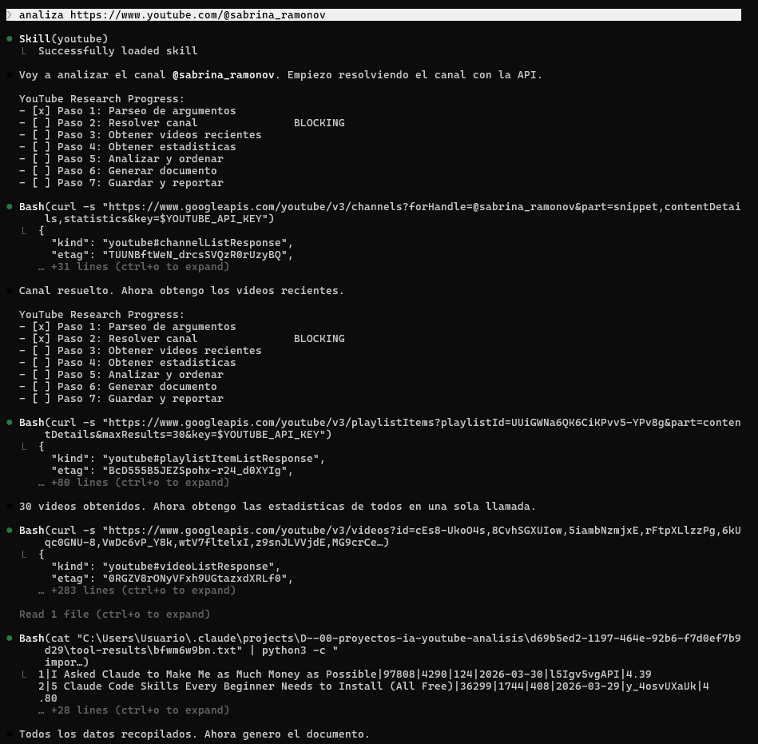
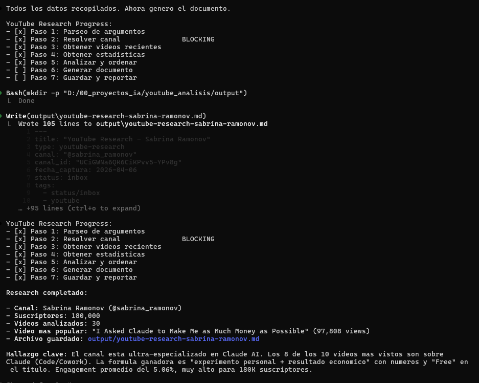

# YouTube Channel Research Skill

A YouTube channel analyzer skill for Claude Code. Fetches the latest 30 videos, calculates engagement metrics, and generates a content strategy analysis — all from 3 API calls.

## Capabilities

- **Channel Stats**: Subscribers, total videos, description
- **Top Videos Table**: 30 most recent videos sorted by views with likes, comments, and dates
- **Engagement Metrics**: Average views, likes, engagement ratio (likes/views)
- **Content Analysis**: What works, what doesn't, and actionable recommendations
- **Obsidian-ready**: Output includes YAML frontmatter compatible with Obsidian vaults

## Screenshots

### Skill execution (progress checklist + API calls)



### Output generation



## Installation

```bash
claude plugins add /path/to/claude_skills/youtube-channel-research
```

## Setup

Requires a free YouTube Data API v3 key:

```bash
# Linux/macOS
export YOUTUBE_API_KEY="your-api-key"

# Windows
setx YOUTUBE_API_KEY "your-api-key"
```

Get a key at [Google Cloud Console](https://console.cloud.google.com/apis/credentials) enabling the YouTube Data API v3.

## Usage

```
/youtube-channel-research @midudev
/youtube-channel-research @ThePrimeagen -o primeagen.md
/youtube-channel-research @AlexHormozi -d my-vault/research/
```

## Example Output

See full examples in the [examples/youtube-channel-research](../examples/youtube-channel-research/) folder:

- [youtube-research-sabrina-ramonov.md](../examples/youtube-channel-research/youtube-research-sabrina-ramonov.md)
- [youtube-research-alexhormozi.md](../examples/youtube-channel-research/youtube-research-alexhormozi.md)

## Source

Uses the [YouTube Data API v3](https://developers.google.com/youtube/v3) via curl. Only 3 API calls per execution (channels, playlistItems, videos).
