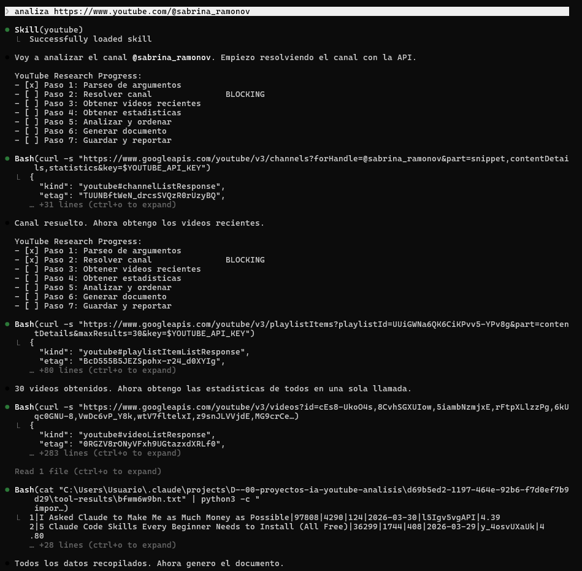
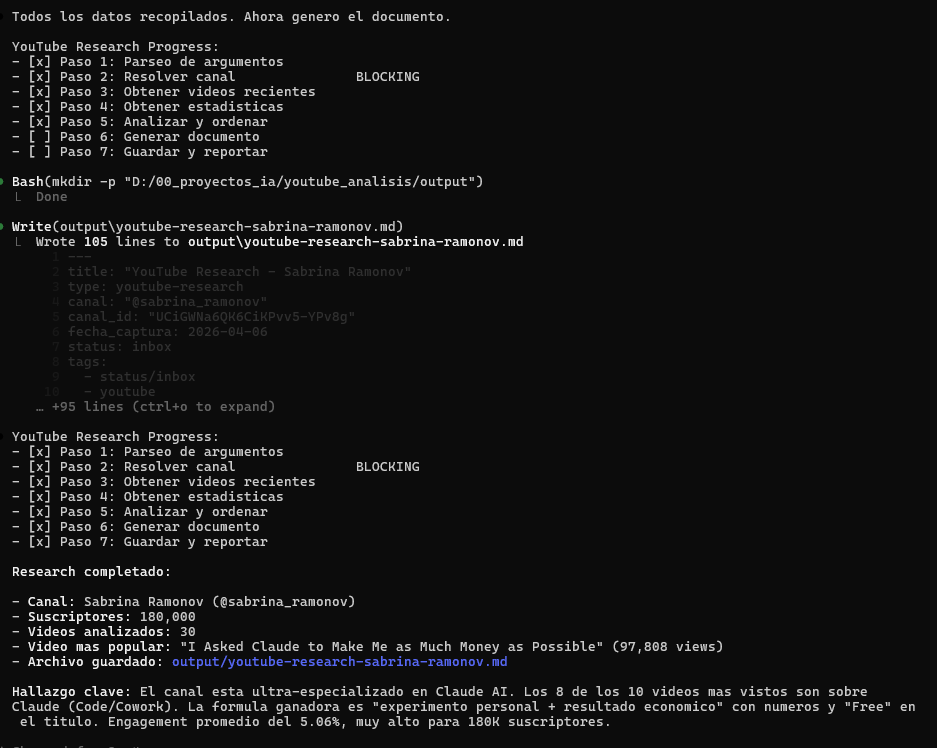

# YouTube Channel Research Skill

Skill para Claude Code que analiza canales de YouTube. Obtiene los 30 videos mas recientes, calcula metricas de engagement y genera un analisis de estrategia de contenido — todo en 3 llamadas a la API.

## Capacidades

- **Datos del canal**: Suscriptores, total de videos, descripcion
- **Tabla de videos**: Los 30 mas recientes ordenados por views con likes, comentarios y fechas
- **Metricas de engagement**: Promedio de views, likes, ratio de engagement (likes/views)
- **Analisis de contenido**: Que funciona, que no, y recomendaciones accionables
- **Compatible con Obsidian**: El output incluye frontmatter YAML

## Capturas

### Ejecucion del skill (progress checklist + llamadas API)



### Generacion del output



## Instalacion

Copia esta carpeta (`youtube-channel-research/`) dentro de tu proyecto, en
`.claude/skills/`:

```bash
git clone https://github.com/seoutopico/claude_skills
# copia la carpeta youtube-channel-research/ a tu-proyecto/.claude/skills/
```

```
tu-proyecto/
└── .claude/
    └── skills/
        └── youtube-channel-research/
            ├── SKILL.md
            └── examples/
```

Cierra y abre Claude Code de nuevo.

## Configuracion

Necesitas una API key de YouTube Data API v3 (gratis).

**Opcion 1 — Variable de entorno:**

```bash
# Linux/macOS
export YOUTUBE_API_KEY="tu-api-key"

# Windows
setx YOUTUBE_API_KEY "tu-api-key"
```

**Opcion 2 — En `.claude/settings.local.json`:**

```json
{
  "env": {
    "YOUTUBE_API_KEY": "tu-api-key"
  }
}
```

Consigue una key gratis en [Google Cloud Console](https://console.cloud.google.com/apis/credentials) activando la YouTube Data API v3.

## Uso

Escribe el comando seguido del canal que quieras analizar:

```
/youtube-channel-research @midudev
```

### Opciones avanzadas

| Flag | Que hace | Ejemplo |
|------|----------|---------|
| `-o` | Elige el nombre del archivo de salida | `/youtube-channel-research @midudev -o midudev.md` |
| `-d` | Elige la carpeta donde guardar el resultado | `/youtube-channel-research @midudev -d research/` |

Si no usas flags, el archivo se genera automaticamente en la carpeta `output/`.

## Ejemplos de output

Mira ejemplos reales en la carpeta [examples/](./examples/):

- [youtube-research-sabrina-ramonov.md](./examples/youtube-research-sabrina-ramonov.md)
- [youtube-research-alexhormozi.md](./examples/youtube-research-alexhormozi.md)
- [youtube-research-peteryangyt.md](./examples/youtube-research-peteryangyt.md)

## Fuente

Usa la [YouTube Data API v3](https://developers.google.com/youtube/v3) via curl. Solo 3 llamadas por ejecucion (channels, playlistItems, videos).

---

## Autora

**Aina-Lluna Taylor** — Desarrollo herramientas de IA para resolver problemas reales.

- [Newsletter ainalluna](https://ainalluna.substack.com/) — IA aplicada, herramientas y automatizacion. Suscribete.
- [Web](https://ainalluna.com/)
- [LinkedIn](https://www.linkedin.com/in/ainataylor/)
